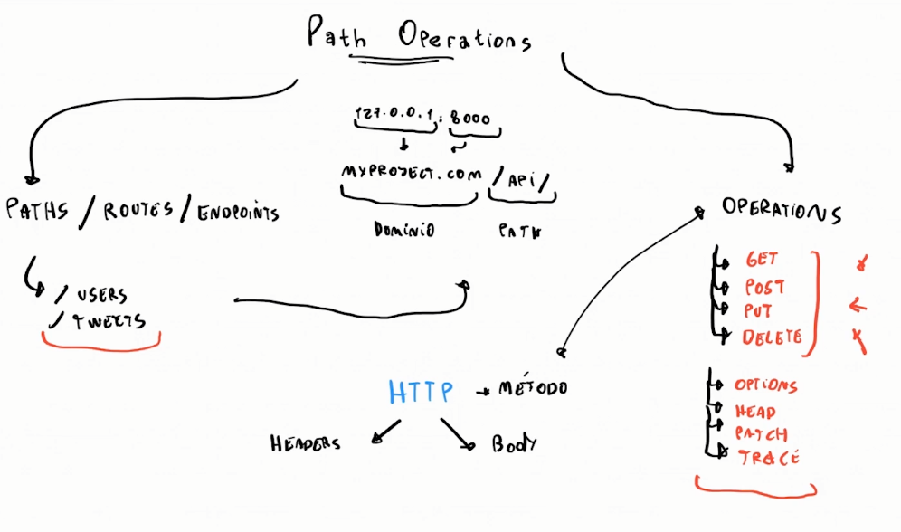
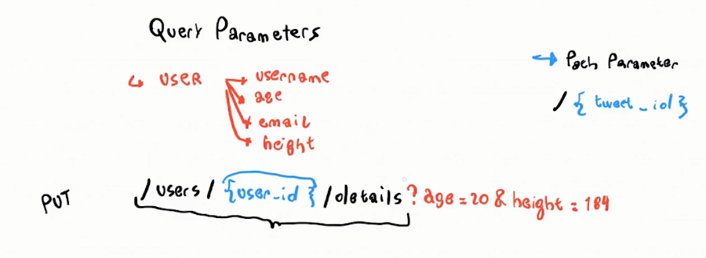
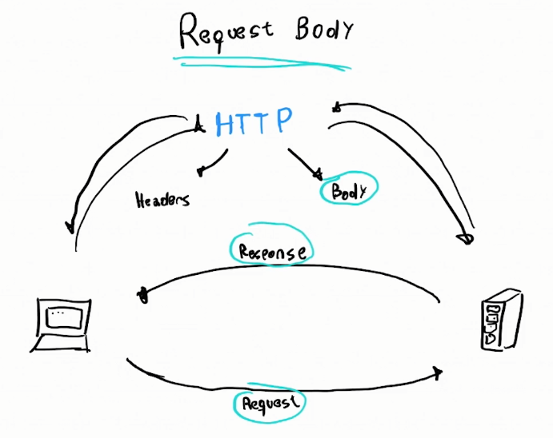

# ¿Que es FastAPI?

El framework mas veloz para el desarrollo web con Python. Enfocado para realizar APIs, es el mas rápido en lo que respecta a la velocidad del servidor superando a Node.Js y a GO. Fue creado por Sebastian Ramirez, es de código abierto y se encuentra en Github, es usado por empresas como Uber, Windows, Netflix y Office.

Documentación: https://fastapi.tiangolo.com

Código Fuente: https://github.com/tiangolo/fastapi

# Ubicación de FastAPI en el ecosistema de Python

FastAPI utiliza otros frameworks dentro de si para funcionar

***FastAPI está parado sobre los hombros de gigantes***

- Uvicorn: es una librería de Python que funciona de servidor, es decir, permite que cualquier computadora se convierta en un servidor.
- Starlette: es un framework de desarrollo web de bajo nivel, para desarrollar aplicaciones con este requieres un amplio conocimiento de Python, entonces FastAPI se encarga de añadirle funcionalidades por encima para que se pueda usar mas fácilmente.
- Pydantic: Es un framework que permite trabajar con datos similar a pandas, pero este te permite usar modelos los cuales aprovechara FastAPI para crear la API.

# Proyecto [hello-world](fast-api-hello-world/main.py)

# Documentación interactiva de una API

FastAPI utiliza OpenAPI, el cual es un conjunto de reglas que permite definir cómo describir, crear y visualizar APIs. Es un conjunto de reglas que permiten decir que una API está bien definida.

OpenAPI necesita de un software, el cual es Swagger, que es un conjunto de softwares que permiten trabajar con APIs. FastAPI funciona sobre un programa de Swagger el cual es Swagger UI, que permite mostrar la API documentada.

Acceder a la documentación interactiva con:

- *Swagger UI* : {localhost}/docs
- *Redoc* : {localhost}/redoc

# Path Operations

Path: Es una routa (route o endpoint) la cual nosotros ingresamos seguido el dominio de nuestro aplicativo.

127.0.0.1:8000 -> myproject.com/API/
                    
                    Diminio/Path ->

Operation: Es un metodo http por el cual nos comunicamos. 

Metodo:

- Head
- Patch

Options:

- Get: Obtener
- Post: Crear
- Put: Modificar/Actualizar
- Delete: Eliminar

Path Operations -> Utilizando Metodos y Options

# Path Operation Decorator

~~~python
@app.get("/") # Primera parte
def home(): # Segunda parte
    return {"message": "Hello World"}
~~~

*Primera parte (Path Operator Decorator)* : permite el ingreso de una path a una operation designada para la ejecucion de un codigo.

*Segunda parte (Path Operation Function)* : realiza la ejecucion de un codigo siguiendo la especificación del path operation decorator llamado anteriormente

# Path Parameters
Definiendo una variable en el path
~~~python
"/users/{user_id}" # user_id es una variable
~~~
Los parámetros de ruta son partes variables de una ruta URL . Por lo general, se utilizan para señalar un recurso específico dentro de una colección, como un usuario identificado por ID. Una URL puede tener varios parámetros de ruta.

# Query Parameters
Añadiendo parametros a la URL para filtrar los resultados

Query Patameter es un conjunto de elementos opcionales los cuales son añadidos al finalizar la ruta, con el objetivo de definir contenido o acciones en la url,
estos elementos se añaden despues de un ?
para agregar más query parameters utilizamos &

# Request/Response Body

Debes saber que bajo el protocolo HTTP existe una comunicación entre el usuario y el servidor. Esta comunicación está compuesta por cabeceras (headers) y un cuerpo (body). Por lo mismo, se tienen dos direcciones en la comunicación entre el cliente y el servidor y definen de la siguiente manera:

- Request : Cuando el cliente solicita/pide datos al servidor.
- Response : Cuando el servidor responde al cliente.
- Request Body: viene a ser el cuerpo (body) de una solicitud del cliente al servidor.
- Response Body: viene a ser el cuerpo (body) de una respuesta del servidor al cliente.
  
  